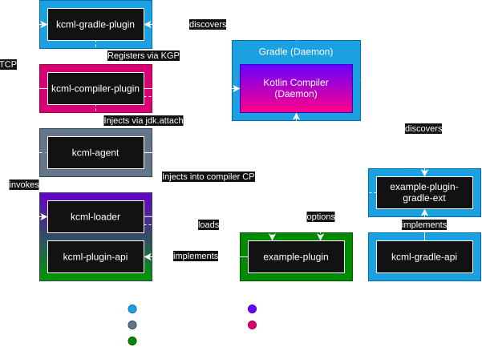

# ↺ KCML

[](https://git.karmakrafts.dev/kk/kcml/-/pipelines)
[](https://git.karmakrafts.dev/kk/kcml/-/packages)
[](https://git.karmakrafts.dev/kk/kcml/-/packages)
[](https://kotlinlang.org/)
[](https://docs.karmakrafts.dev/kcml-plugin-api)


The Kotlin Compiler Meta Loader project allows multiple Kotlin compiler plugins to interoperate  
and provides a stable API for FIR, IR and backend processing.  
It also exposes some additional internals of the compiler to allow extending Kotlin beyond the IR.

> KCML heavily tampers with the compiler based on what meta plugins are applied.  
> In order to prevent an influx of false reports on the Kotlin issue tracker,  
> **please do not report any issues occurring in a project setup that uses KCML to the Kotlin
> issue tracker!**  
> Report the issue to the KCML repository and we will delegate the issue if needed.

This project is in now way associated with Kotlin or JetBrains. Use at your own risk!

### How it works



### Recommendations

It is recommended to use KCML in conjunction with the in-process compiler execution mode.
This can be enabled by adding the following to your `gradle.properties`:

```properties
kotlin.compiler.execution.strategy=in-process
```